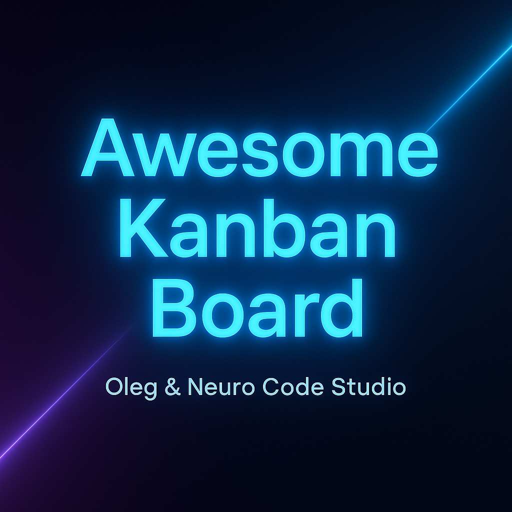

<p align="center">
  
</p>

<p align="center">
  <i>Современная Kanban-доска, созданная в студии <b>Oleg & Neuro Code Studio</b><br>
  Логика, дизайн и эмоции — в неоновой гармонии.</i>
</p>

<h1 align="center">🧭 Awesome Kanban Board</h1>

<p align="center">
  Современная Kanban-доска на React, созданная студией  
  <b>✨ Oleg & Neuro Code Studio</b> — там, где логика, дизайн и эмоции живут в гармонии.
</p>

<p align="center">
  <a href="https://react.dev/"></a>
  <a href="https://create-react-app.dev/"></a>
  <a href="https://pages.github.com/"></a>
  <a href="./LICENSE"></a>
  <a href="https://github.com/Olegmbq/kanban-board/releases"></a>
</p>

<p align="center">
  🇷🇺 Русская версия | <a href="./README.en.md">🌍 English version</a>
</p>

<p align="center">
  
</p>

<h2 align="center">💎 The Official Identity of <b>Oleg & Neuro Code Studio</b></h2>

<p align="center">
  <em>Crafted in neon & harmony — a fusion of logic, art, and emotion.</em><br>
  <sub>💫 We don’t just design — we illuminate.</sub><br>
  <sub>🧠 Built with passion by <b>Oleg & Neuro Code Studio</b></sub>
</p>

---

## 🌐 Онлайн-демо

🔗 **[Открыть Kanban Board в браузере](https://olegmbq.github.io/kanban-board/)**

Попробуй добавлять задачи, перемещать их между колонками и перезагружать страницу —  
все данные сохраняются автоматически с помощью `localStorage`.

---

## 💡 О проекте

**Awesome Kanban Board** — это лёгкое интерактивное приложение  
для управления задачами с сохранением состояния прямо в браузере.

Проект демонстрирует архитектуру React, чистую структуру компонентов  
и логику передачи данных между ними без сторонних библиотек.

---

## ⚙️ Технологии

⚛️ <b>React 19</b> — современный JavaScript-фреймворк  
🧭 <b>React Router DOM 7</b> — маршрутизация и навигация  
🏗️ <b>Create React App</b> — базовая среда разработки и сборка  
💾 <b>LocalStorage API</b> — хранение данных в браузере  
🎨 <b>CSS-модули / inline-стили</b> — оформление интерфейса  
🧠 <b>JavaScript (ES6+)</b> — логика компонентов и состояние  
🌐 <b>GitHub Pages</b> — деплой и хостинг  
🧩 <b>Node.js + npm</b> — зависимости и сборка

---

## 🗂️ Структура проекта

📁 <b>kanban-board/</b>
├── 📁 <b>public/</b> — Базовые HTML-файлы и favicon  
├── 📁 <b>src/</b> — Исходный код приложения  
│ ├── 📁 <b>components/</b> — Компоненты интерфейса  
│ │ ├── 📁 <b>Board/</b> — Главная Kanban-доска  
│ │ └── 📁 <b>Column/</b> — Колонка задач  
│ ├── 📁 <b>data/</b> — Мок-данные (dataMock.js)  
│ ├── 📁 <b>pages/</b> — Страницы (TaskPage)  
│ ├── 📄 <b>App.js</b> — Маршрутизация и структура  
│ ├── 📄 <b>index.js</b> — Точка входа с HashRouter  
│ └── 📄 <b>styles.css</b> — Основные стили  
├── 📁 <b>brand/</b> — Обложка и бренд-ресурсы проекта  
├── 📁 <b>screenshots/</b> — Скриншоты и визуалы  
├── ⚙️ <b>.gitignore</b> — Исключённые из репозитория файлы  
├── 📦 <b>package.json</b> — Зависимости и скрипты npm  
└── 📘 <b>README.md</b> — Документация проекта

---

## 🚀 Возможности

- Добавление новых задач в колонку **Backlog**
- Перемещение между этапами: _Ready → In Progress → Finished_
- Подсчёт активных и завершённых задач
- Автоматическое сохранение данных в `localStorage`
- Кнопка **Reset Board** для сброса состояния
- Чистая структура и понятная логика

---

## 🧩 Установка и запуск

```bash
git clone https://github.com/Olegmbq/kanban-board.git
npm install
npm start
```

---

🌐 Деплой

Приложение развёрнуто через GitHub Pages
и доступно по адресу:

🔗 https://olegmbq.github.io/kanban-board/

---

🎨 Авторы

---

## ❤️ Created with Love

<p align="center">
  <br><br>

<h3 align="center">✨ Oleg & Neuro Code Studio</h3> <p align="center"> <i>"Создано в неоне и гармонии"</i><br> Разработано с любовью, логикой и вниманием к деталям 💙 </p>
<p align="center"> © 2025 <b>Oleg & Neuro Code Studio</b><br> <i>Твоя идея. Наш код. Единая гармония.</i><br> <sub>🪄 Crafted with care & creativity</sub> </p>

---

<p align="center" style="font-weight:bold; color:#ff00cc;">
✨ “We don’t just code — we illuminate.” ✨
</p>
