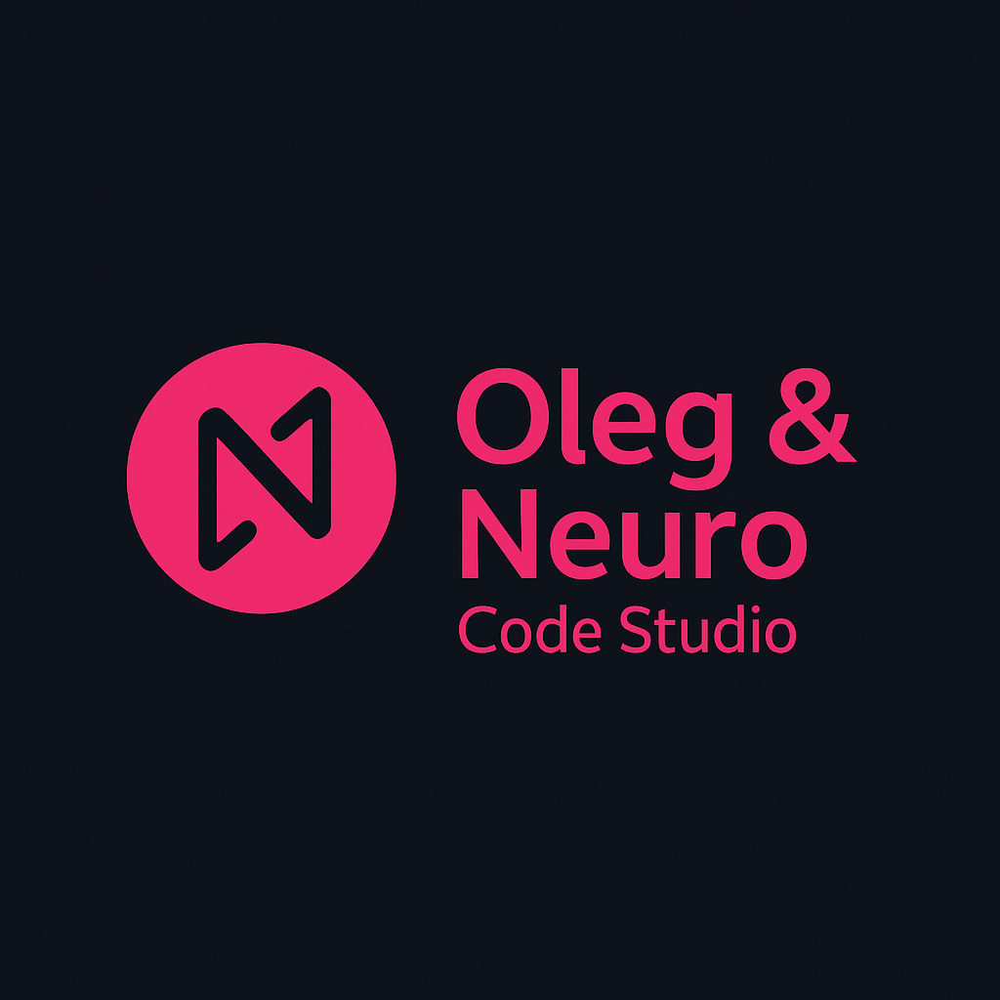
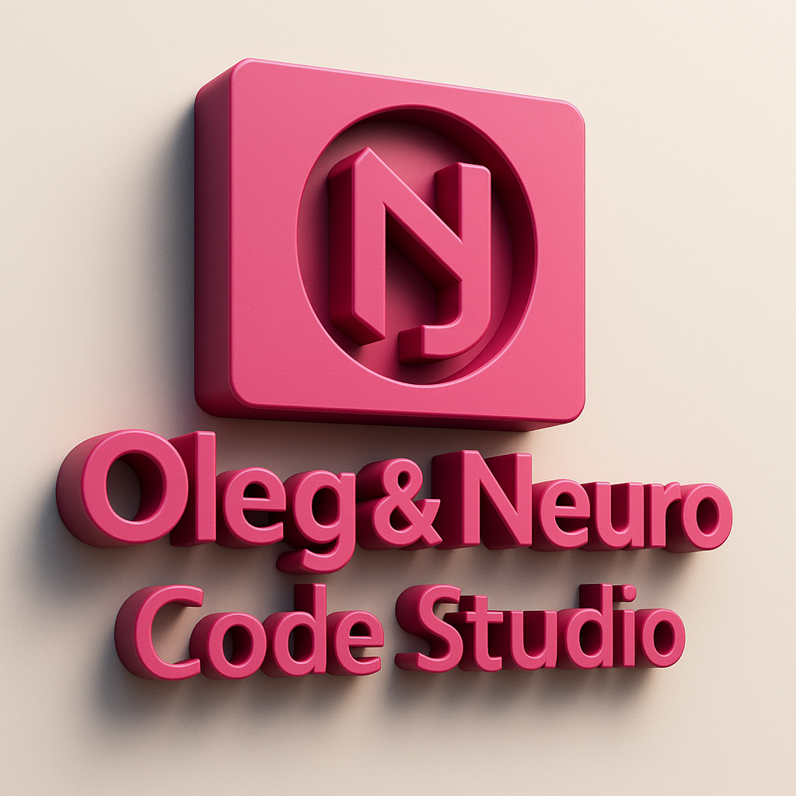
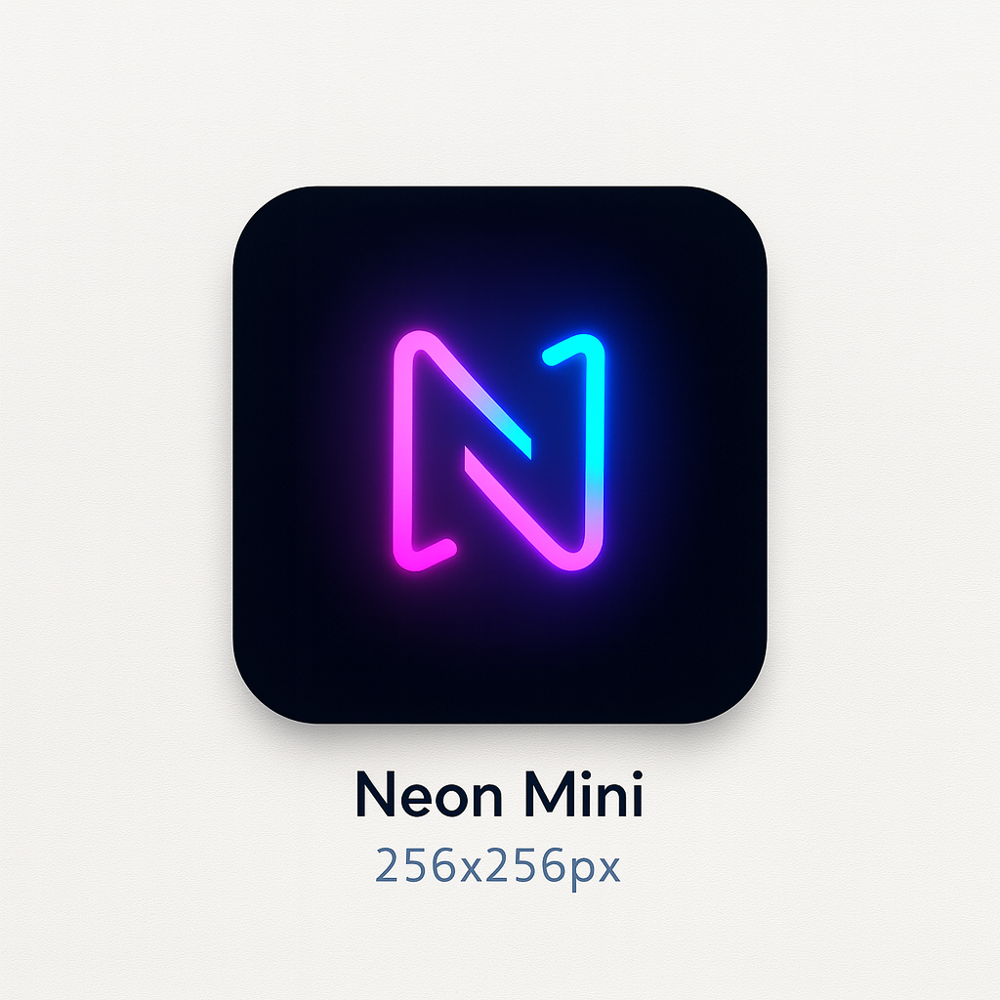
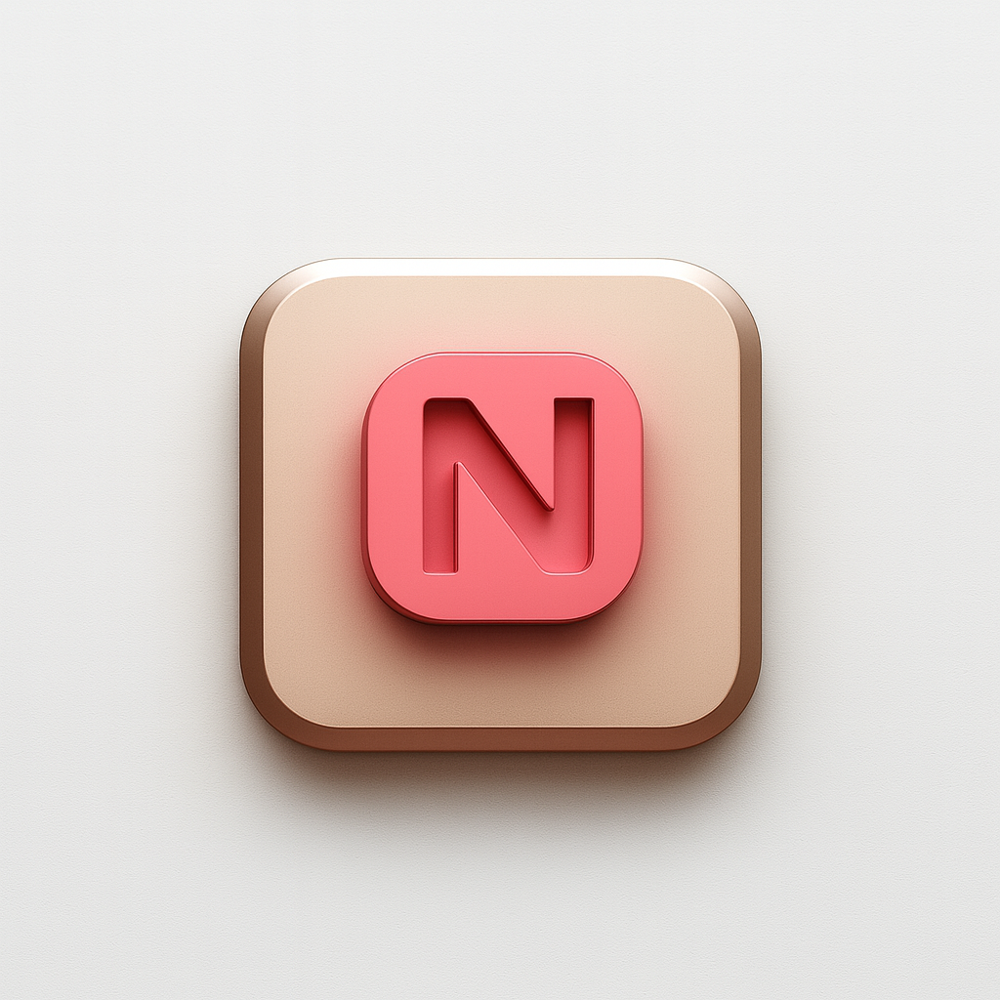
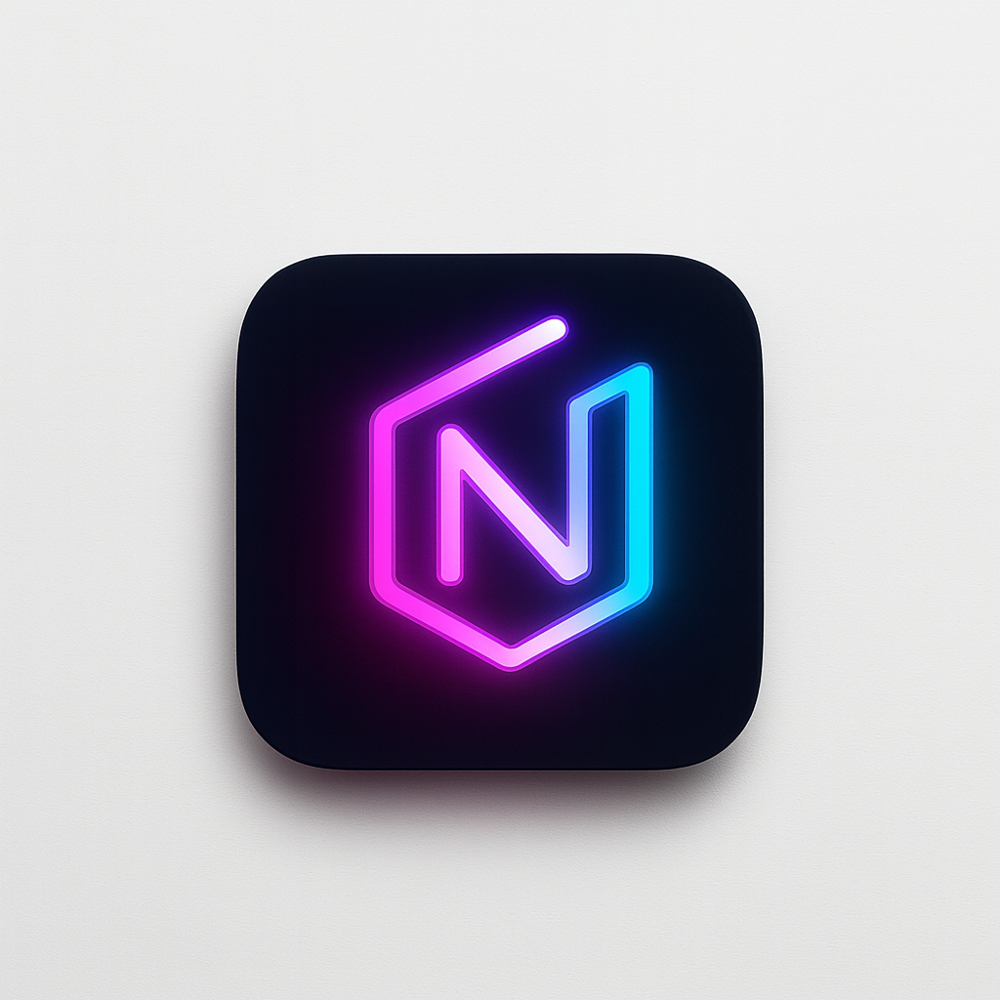
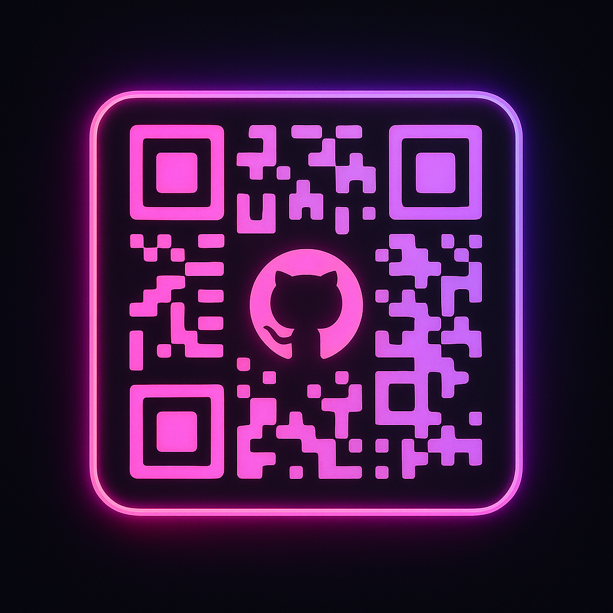
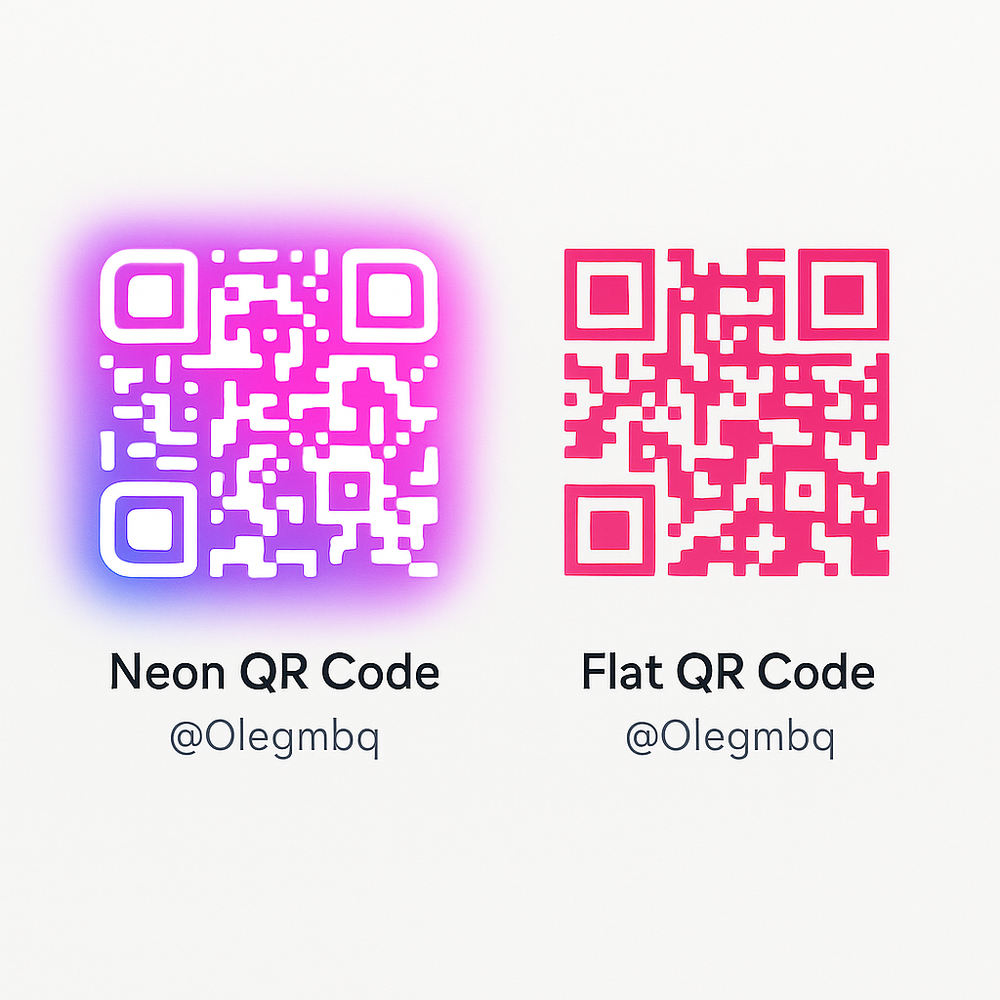

<!-- 💡 Local Dev Buttons for VSCode or Live Server -->

<p align="center">
  
  
</p>
<p align="center">
  <a id="brand-link" href="#" target="_blank">
    
  </a>
  <a id="bookshop-link" href="#" target="_blank">
    
  </a>
  <a href="https://github.com/Olegmbq" target="_blank">
    
  </a>
</p>

---

## ✨ Overview

This **Brand Kit** contains the full visual identity of  
**Oleg & Neuro Code Studio** — a fusion of logic, art, and emotion.  
It’s designed to maintain consistency across all media, from web and print to digital interfaces.

> _“We don’t just design — we illuminate.”_ 💫

---

## 🧩 Main Logos

|                         Preview                          | Description                                                       |
| :------------------------------------------------------: | :---------------------------------------------------------------- |
|        | **Primary Logo** — used for docs, GitHub, and official materials. |
|  | **3D Metallic Logo** — premium look for presentations and print.  |
|      | **Neon Holographic** — for web, motion, and promo visuals.        |
|     | **White Mono** — perfect for dark backgrounds and overlays.       |

---

## 🌈 Mini Assets

|                     Preview                      | Description                                              |
| :----------------------------------------------: | :------------------------------------------------------- |
|   | **Neon Mini** — glowing futuristic icon for digital use. |
|  | **3D Mini** — realism for branding and prints.           |
|   | **Flat Mini** — clean and minimal for docs and UI.       |

---

## 🔗 QR Codes

|                    Preview                    | Description                                                     |
| :-------------------------------------------: | :-------------------------------------------------------------- |
|  | **Neon QR Code** — glowing futuristic style for GitHub @Olegmbq |
|  | **Flat QR Code** — minimal print version for documentation.     |

> Scan QR codes to visit our GitHub: **[@Olegmbq](https://github.com/Olegmbq)**

---

## 🎨 Brand Palette

| Color       | HEX       | Usage                                       |
| :---------- | :-------- | :------------------------------------------ |
| Neon Pink   | `#FF00CC` | Primary accent (buttons, links, highlights) |
| Violet Glow | `#B300FF` | Gradients & holographic effects             |
| Cyan Light  | `#00FFFF` | Contrast accent for depth                   |
| Dark Space  | `#0A0014` | Background for neon composition             |
| Soft White  | `#F5F5F5` | Text & readable contrast areas              |

---

## 🧱 Brand Essence

> _“We don’t just code — we create digital stories.”_  
> A fusion of **logic, art, and emotion** — built by **Oleg & Neuro Code Studio**.

Every asset reflects our philosophy: **clarity, creativity, and connection**.  
From logo structure to neon light diffusion — it’s crafted for harmony and inspiration.

---

## 🪩 Usage Rules

✅ You may use these assets for:

- Portfolio and presentation visuals
- Web previews, brand showcases, or studio mentions
- Collaborations with credit

🚫 Do **not**:

- Modify logos without approval
- Recolor or distort proportions
- Use assets for commercial redistribution

---

## 🧠 File Structure

```bash
brand/
├── assets/
│   ├── favicon.ico
│   ├── favicon-32.png
│   ├── favicon-192.png
│   ├── favicon-512.png
│   ├── logo_primary.png
│   ├── logo_neon_holo.png
│   ├── logo_white_mono.png
│   ├── logo_metal_premium.png
│   ├── neon-mini.png
│   ├── metal-mini.png
│   ├── flat-mini.png
│   ├── qr_neon.png
│   ├── qr_flat.png
│
├── index.html ← Brand Kit Page
└── README.md ← You’re here 💎

---

👨‍💻 Authors
Oleg & Neuro Code Studio

“We don’t just code — we create digital stories.”
Мы не просто пишем код — мы создаём вдохновение.

---

```

## ❤️ Created with Love

<p align="center">
  <br><br>

<strong>Created with ❤️ by
<a href="https://github.com/Olegmbq" target="_blank">Oleg & Neuro Code Studio</a>
</strong><br>
<em>🧠 A fusion of logic, art & emotion — built with harmony and inspiration.</em><br>
<sub>© 2025 Oleg & Neuro Code Studio — All Rights Reserved.</sub>

</p>

---

<p align="center">
  🌙 Thank you for exploring our Brand Kit — glowing with light & soul.<br>
  ✨ Crafted with harmony by <b>Oleg & Neuro Code Studio</b><br>
  🧠 Logic • 🎨 Art • ❤️ Emotion — one luminous identity.<br><br>

  <pre align="center" style="color:#b300ff; font-weight:bold;">
╔═════════════════════════════════════════════════════╗
║ ⚡ Oleg & Neuro Code Studio ❤️‍🔥  Brand Universe ║
╚═════════════════════════════════════════════════════╝
  </pre>

<br>
<b>Oleg & Neuro Code Studio</b>

</p>
