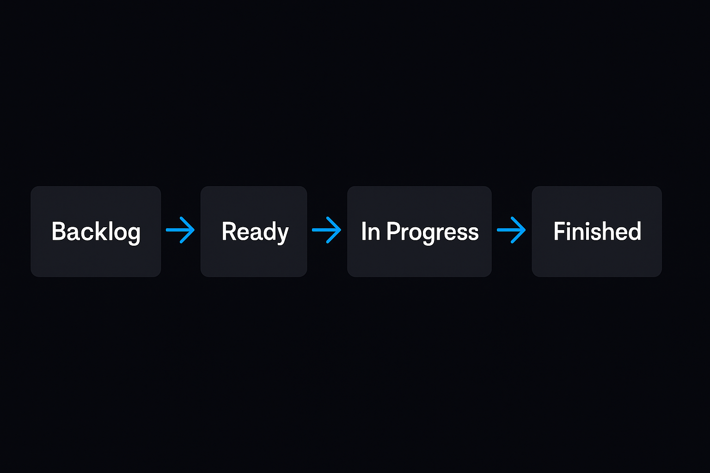
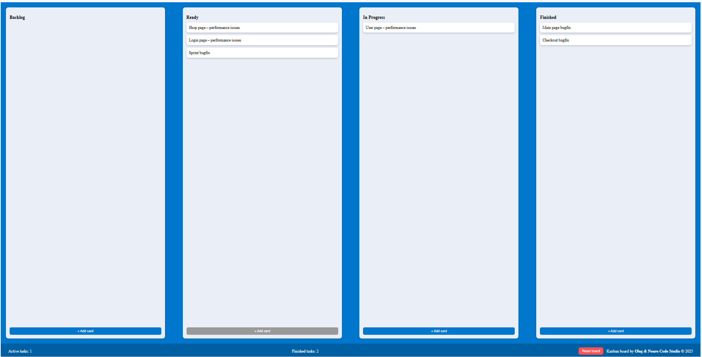
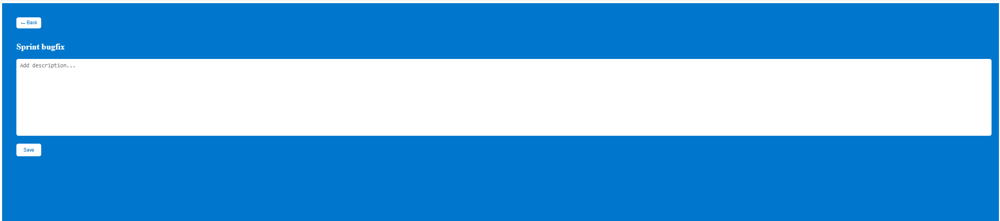

# 🧩 **Awesome Kanban Board**

### _Crafted by Oleg & Neuro Code Studio_ ⚙️💙

<p align="center">
  
</p>

---

## 📖 Описание проекта

**Awesome Kanban Board** — это минималистичная, но мощная web-доска для управления задачами в стиле **Kanban**.  
Создана с вниманием к чистоте кода и стабильности работы, на **React 19** и **React Router v7**.  
Все данные сохраняются в `localStorage`, чтобы даже после перезагрузки сессия не терялась.

---

## 🌐 Live Demo

🎯 **Онлайн-версия проекта доступна здесь:**  
👉 [**Awesome Kanban Board — Live Demo**](https://kanban-board-oleg-neuro.vercel.app)

_(Если ссылка не активна — значит проект пока в локальной среде.  
Позже можно будет развернуть на [Vercel](https://vercel.com/) или [Netlify](https://www.netlify.com/).)_

---

## 🚀 Основные возможности

- 📝 Добавление новых карточек в **Backlog**
- 🔄 Пошаговое перемещение задач между этапами
- 💾 Автосохранение данных в браузере
- 🔁 Кнопка **Reset Board** — возвращает всё к исходному состоянию
- 📊 Счётчики активных и завершённых задач
- 🌐 Переход на страницу отдельной задачи

---

---

## ⚙️ How it works

Каждая задача проходит четыре стадии жизненного цикла:

🧩 **Backlog** — сюда добавляются все новые идеи и задачи.  
⚙️ **Ready** — здесь находятся задачи, которые готовы к выполнению.  
🔧 **In Progress** — активные задачи, над которыми идёт работа.  
✅ **Finished** — завершённые и проверенные задачи.

Каждая карточка плавно “путешествует” по колонкам,  
а количество активных и завершённых задач отображается внизу доски.

<p align="center">
  
</p>

---

## 📸 Скриншоты

<p align="center">
  <br><br>
  
</p>

---

## ⚙️ Запуск проекта

```bash
npm install
npm start
```

---

## 🧠 Tech Stack & Architecture

Проект **Awesome Kanban Board** создан с использованием современного стека фронтенд-разработки:

- ⚛️ **React 19** — компонентный подход и реактивное управление состоянием.
- 🧭 **React Router DOM 7** — маршрутизация страниц (доска / страница задачи).
- 💾 **LocalStorage API** — сохранение состояния между сессиями.
- 🎨 **CSS-модули** и инлайн-стили — лёгкая стилизация без сторонних библиотек.
- 🚀 **Create React App** — надёжная сборка, запуск и деплой проекта.

---

### 📂 Архитектура проекта

kanban-board/
│
├── public/ # HTML-шаблон, favicon и манифест
├── src/
│ ├── components/
│ │ ├── Board/ # Основная доска с колонками
│ │ ├── Column/ # Отдельная колонка Kanban
│ │ └── Task/ # Компонент карточки задачи (опционально)
│ │
│ ├── pages/
│ │ └── TaskPage/ # Страница конкретной задачи
│ │
│ ├── data/
│ │ └── dataMock.js # Исходные данные по умолчанию
│ │
│ ├── App.js # Главный компонент маршрутизации
│ ├── index.js # Точка входа React
│ └── index.css # Базовые стили
│
├── brand/ # Обложка и фирменные ресурсы студии
├── screenshots/ # Скриншоты и схема flow-диаграммы
├── README.md # Описание проекта
└── package.json # Зависимости и команды npm

---

### 🧩 Особенности

- Подсчёт активных и завершённых задач.
- Кнопка **Reset board** для очистки данных.
- Плавная анимация карточек при добавлении и переносе.
- Сохранение состояния между перезагрузками.
- Авторский дизайн в стиле **Oleg & Neuro Code Studio** 🌌

---

### 💡 Авторство

Создано с любовью и вниманием к деталям:  
**Oleg & Neuro Code Studio** — crafted in neon & harmony ✨

🌌 Brand Footer

<p align="center"> <strong>Oleg & Neuro Code Studio</strong><br> <em>crafted in neon & harmony ⚙️💙</em><br> <a href="https://github.com/Olegmbq" target="_blank">github.com/Olegmbq</a> </p>
